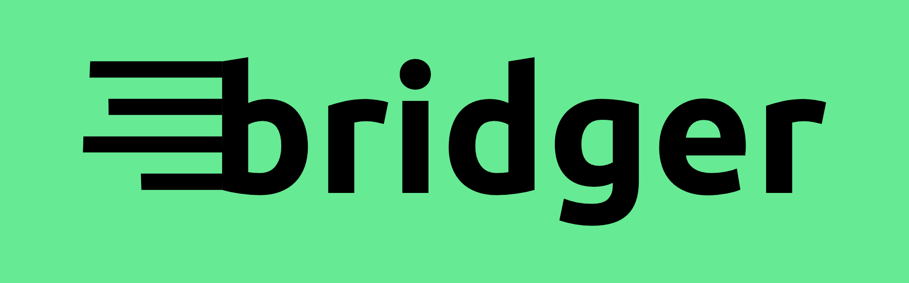

# 

Bridger is a Meshtastic MQTT to InfluxDB metrics bridge. It listens to MQTT for protobuf messages and uses those to push metrics to InfluxDB.

## Usage

You will need InfluxDB and a MQTT broker running or available already.

Copy the the `.env.default` file to `.env` and view for the environment variables that can be set. The following are required:

 - MQTT_TOPIC
 - MQTT_BROKER
 - MQTT_USER
 - MQTT_PASS
 - INFLUXDB_V2_BUCKET
 - INFLUXDB_V2_ORG
 - INFLUXDB_V2_TOKEN
 - INFLUXDB_V2_URL

There are some other tunables as well:

 - INFLUXDB_V2_WRITE_PRECISION
 - MESHTASTIC_API_CACHE_TTL: The time to cache the Meshtastic API data. Defaults to 6 hours.
 - MESHTASTIC_KEY: The base64 encoded encryption key for the primary channel. Defaults to the the key provided by `AQ==`
 - MQTT_TEST_CHANNEL
 - MQTT_TEST_CHANNEL_ID
 - DISCORD_BOT_TOKEN
 - DISCORD_BOT_OWNER_ID
 - BRIDGER_ADMIN_ROLE
 - EMQX_API_KEY
 - EMQX_SECRET_KEY
 - EMQX_URL
 - LOG_PATH: Set this to a file path to log to a file. Defaults to `logs/bridger.log`


Then install the required packages in a Python virtual environment:

```bash
pip install -r requirements.txt
```

And run the script:

```bash
python -m bridger
```

## Node Setup

To get your Meshtastic node to send metrics to the MQTT broker you will need to set the following settings:

MQTT Module:

* Enabled: `Checked`
* MQTT Server Address: `mqtt.austinmesh.org`
* MQTT Username: <created_per_user>
* MQTT Password: <created_per_user>
* Encryption Enabled: `Unchecked`
* JSON Enabled: `Unchecked`
* TLS Enabled: `Unchecked`
* Root topic: `egr/home`

Primary Channel:

* Uplink Enabled: `Checked`

## Podman / Docker

You can run Bridger in a container setup using Docker or Podman Compose. You'll need to set up the `.env` file as above first. You can start by copuing the `.env.default` file to `.env` and editing it.

## Initial Bootstrap

Start by building the images required:

```bash
podman compose build
```

Then create the InfluxDB and EMQX keys that need to go in the `.env` file. You can do this by running the following command:

```bash
podman compose run --rm -v emqx-config:/opt/emqx/etc bridger python3 -m bridger.cli generate-apikey
```

Replace the keys it outputs in the `.env` file. These get written to the EMQX config volume so you only need to do this once.

Now you need to create a user for Bridger in EMQX. You can do this by running the following command (replacing your node ID and Discord ID):

```bash
podman compose run --rm bridger python3 -m bridger.cli create-user 934ccc74 206914075391688704
```

### EMQX

The default EMQX username and password is `admin` / `public`. You will be forced to change this at first login. But you'll already have an API key for Bridger created form the previous steps.

### InfluxDB

You'll need to bootstrap some of InfluxDB. Navigate to http://localhost:8086 and create a user, organization and bucket. The names of these need to match what you put in the `.env` file.

### Run

You can start the containers using:

```bash
podman compose up -d
```

### URLs

 - EMQX Dashboard: http://localhost:18083
 - InfluxDB Dashboard: http://localhost:8086
 - Grafana Dashboard: http://localhost:3000
